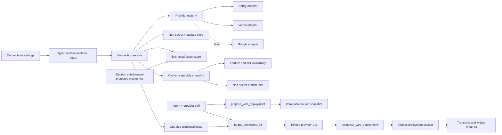

# Web Deployment Implementation Plan

Status: proposed; implementation has not started.

This plan turns [the web-deployment design brief](./design.md) into an
implementable Buddy architecture. It deliberately separates two concepts:

- A **service connection** is a Buddy-managed account connection to an external
  service such as Netlify, Vercel, or, later, Google.
- A **web deployment** is one capability that consumes a service connection.

That separation is the main extensibility boundary. Adding Google OAuth later
must require a provider adapter and product capability wiring, not another auth
store, another settings flow, or Google branches throughout the app.

## Locked V1 Decisions

1. V1 supports both Netlify and Vercel, behind an experimental
   `webDeployment` feature flag.
2. V1 deploys only Buddy-managed `html-widget` objects. Arbitrary workspace
   folders can be added as another target kind later.
3. Netlify offers browser OAuth when Buddy's Netlify OAuth application and
   loopback callback have passed the Phase 0 spike. It also offers a personal
   access token fallback.
4. Vercel uses a user-created, scoped access token in V1. Vercel's general
   deployment permissions for “Sign in with Vercel” are currently private
   beta, so browser OAuth is not a dependable deployment credential yet.
5. Deployment still runs through the official provider CLI. Buddy does not add
   Netlify/Vercel MCP tools or provider deployment APIs.
6. Buddy installs and runs pinned provider CLI versions. It does not assume
   that `node`, `npm`, `npx`, Netlify CLI, or Vercel CLI is globally installed.
7. Buddy-managed credentials are never added to the backend process-wide
   environment or the general agent shell environment.
8. The agent prepares a deployment, runs the provider CLI through a thin
   Buddy credential launcher, then completes the deployment with a generic
   Buddy tool. This provides reliable target association and structured result
   display without making Buddy the deployment engine.
9. Successful managed and ambient-CLI deployments use the same history. Each
   record says whether auth was `buddy-managed` or `ambient-cli`.
10. Importing an existing global CLI login is not part of V1. A global CLI
    login remains unmanaged.

## Provider Feasibility

The providers do not have the same authentication contract, so the shared
system must model auth methods rather than pretend every service is identical.

| Provider | V1 managed connection | CLI credential | Notes |
| --- | --- | --- | --- |
| Netlify | Browser OAuth token flow plus PAT fallback | `NETLIFY_AUTH_TOKEN` | Netlify documents OAuth for public integrations and token-based CLI auth. The loopback redirect must be proven with a real Buddy OAuth app before browser OAuth is enabled. |
| Vercel | Scoped access-token entry | `VERCEL_TOKEN` | Vercel CLI supports token auth, but deployment-capable permissions for its public OAuth/OIDC app flow are not generally available. |
| Google later | Authorization code + PKCE, refresh token | Capability-specific | Uses the same connection service, encrypted store, flow state, routes, and settings UI. Google is not automatically a deployment provider. |

Primary references:

- [Netlify API OAuth guidance](https://docs.netlify.com/api-and-cli-guides/api-guides/get-started-with-api/)
- [Netlify CLI authentication](https://docs.netlify.com/api-and-cli-guides/cli-guides/get-started-with-cli/)
- [Netlify's official deployment skill](https://github.com/netlify/context-and-tools/blob/main/skills/netlify-deploy/SKILL.md)
- [Vercel CLI token option](https://vercel.com/docs/cli/global-options#token)
- [Vercel OAuth scopes and permissions](https://vercel.com/docs/sign-in-with-vercel/scopes-and-permissions)
- [Vercel's token-based CLI skill](https://github.com/vercel-labs/agent-skills/blob/main/skills/vercel-cli-with-tokens/SKILL.md)
- [Electron `safeStorage`](https://www.electronjs.org/docs/latest/api/safe-storage)

## Architecture



The shared connection system knows how to manage connection lifecycle and
credentials. Provider adapters know provider endpoints, auth details, account
verification, and runtime credential bindings. Deployment skills know the
provider CLI workflow. These responsibilities must not cross boundaries.

## 1. Connected-Service Domain

Create `packages/buddy/src/connections/` as a Buddy-owned domain. Do not reuse
the OpenCode LLM-provider `auth.json` namespace or `/api/provider` routes.

### Public provider definition

The registry is compile-time and typed. V1 does not need a dynamic plugin
loader.

```ts
type ConnectionCapability = "web-deployment"

type PublicConnectionAuthMethod = {
  id: string
  kind: "browser" | "token"
  label: string
  helpURL?: string
}

type ConnectionProviderPresentation = {
  displayName: string
  description: string
  iconID: string
}

type ConnectionProviderDefinition<ProviderID extends string> = {
  id: ProviderID
  presentation: ConnectionProviderPresentation
  capabilities: readonly ConnectionCapability[]
  authMethods: readonly PublicConnectionAuthMethod[]
  adapter: ConnectionProviderAdapter
}
```

Use `defineConnectionProvider()` and a single registry. Shared code looks up a
definition by ID; it must not contain `if (providerID === "netlify")` or a
provider switch. Provider-specific behavior stays in
`connections/providers/netlify.ts` and `connections/providers/vercel.ts`.

### Adapter contract

The adapter contract should cover lifecycle, not just OAuth:

```ts
type ConnectionProviderAdapter = {
  beginAuth: (input: BeginConnectionAuthInput) => Promise<ConnectionAuthStart>
  completeAuth: (input: CompleteConnectionAuthInput) => Promise<StoredCredential>
  verifyCredential: (credential: StoredCredential) => Promise<VerifiedAccount>
  refreshCredential?: (credential: StoredCredential) => Promise<StoredCredential>
  revokeCredential?: (credential: StoredCredential) => Promise<void>
  runtimeBindings: readonly RuntimeCredentialBinding[]
}
```

The discriminated auth-start result supports the methods Buddy will need
without changing its route or UI contract:

- `browser-redirect`: OAuth authorization URL and pending flow ID.
- `secret-input`: token field and provider help URL.
- `device-code`: reserved for a later provider.

PKCE verifiers, OAuth state, and device codes are pending-flow state, not
connection records. Pending flows are memory-only, expire after a centralized
timeout, are single-use, and are cancelled on backend restart.

### Public connection summary

The frontend and prompt receive only a non-secret summary:

```ts
type ConnectionSummary = {
  connectionID: string
  providerID: string
  status: "preparing" | "connected" | "needs-reconnect" | "error"
  authMethodID: string
  capabilities: readonly ConnectionCapability[]
  account: {
    id: string
    label: string
    email?: string
  }
  connectedAt: string
  lastVerifiedAt: string
  expiresAt?: string
  runtimeStatus: "ready" | "installing" | "error"
}
```

There is one active connection per provider in V1, matching Buddy's
single-user/single-active-credential model. Keep `connectionID` in the schema
so multiple accounts can be introduced later without replacing every API.

### Status and validation rules

- A token is validated with the provider before it is committed.
- Netlify reads the current user from its user API.
- Vercel reads the current user from `GET /v2/user`.
- Reconnect is replace-in-place: validate the new credential, atomically swap
  it, then delete the old encrypted entry.
- Disconnect removes the encrypted secret first, then metadata, invalidates
  the capability cache, and revokes remotely only when the provider offers a
  dependable revoke operation.
- Listing connections never makes provider network calls. It uses stored
  verification metadata and an in-memory snapshot.
- Expiring OAuth credentials refresh only at an intentional credential-use or
  explicit refresh boundary, never during passive settings or prompt reads.

## 2. Credential Storage

Use a provider-neutral encrypted file store owned by `packages/buddy`, with a
master key protected by Electron `safeStorage`.

### Files

- Non-secret metadata:
  `Global.Path.state/connections.v1.json`
- Encrypted credential envelopes:
  `Global.Path.data/connection-secrets.v1.json`
- Lock files beside each store file.

Writes use the existing file-lock and atomic-file helpers. Schemas are strict
Zod schemas with a top-level version. Corrupt records fail closed and are
reported as `needs-reconnect`; they are never silently dropped or returned.

### Key lifecycle

1. Electron main waits until `app.ready` and checks safe-storage availability.
2. On first run, it generates a random 256-bit master key.
3. It stores only the safeStorage-encrypted master key in the desktop store.
4. It sends the decrypted key to the backend utility in the existing
   `start` utility message, never through `process.env`.
5. `packages/buddy/src/node.ts` configures the secret store before starting the
   Hono server and retains the key only in memory.
6. The backend encrypts each credential with AES-256-GCM using a fresh nonce
   and authenticated envelope metadata.

Packaged macOS and Windows builds fail closed when OS-backed encryption is not
available. There is no plaintext production fallback. Standalone development
uses an explicitly labelled development key provider, and tests inject a
deterministic in-memory key.

The encrypted payload supports both token and OAuth credentials:

```ts
type StoredCredential =
  | { kind: "token"; token: string }
  | {
      kind: "oauth"
      accessToken: string
      refreshToken?: string
      tokenType?: string
      expiresAt?: string
      scopes: readonly string[]
    }
```

Provider-specific extras may be stored inside the encrypted payload through a
schema owned by that adapter. They must not leak into the public summary.

## 3. OAuth and Token Flows

### Shared routes

Add `ConnectionRoutes` under `/api/connections` and regenerate `@buddy/sdk`:

| Method | Route | Purpose |
| --- | --- | --- |
| `GET` | `/providers` | Public provider catalog plus current connection summaries |
| `POST` | `/:providerID/auth` | Start a selected browser or token auth method |
| `POST` | `/:providerID/auth/:flowID/complete` | Submit a token or explicit callback payload |
| `GET` | `/auth/:flowID` | Poll pending browser flow status |
| `DELETE` | `/auth/:flowID` | Cancel a pending flow |
| `POST` | `/:providerID/verify` | Explicitly revalidate an existing connection |
| `DELETE` | `/:providerID` | Disconnect |

No response schema contains secret values. Validation errors use stable error
codes such as `invalid_credential`, `flow_expired`, `flow_state_mismatch`,
`callback_port_in_use`, and `secret_store_unavailable`.

### Browser callback server

Use a small loopback-only callback server owned by the connection service, not
the Basic-authenticated Buddy API server. It listens only while a flow is
pending on a centralized, registered port and path.

- Bind to `127.0.0.1`, not all interfaces.
- Permit one active browser flow at a time.
- Require a high-entropy, single-use state value.
- Use a short expiry.
- Return `Cache-Control: no-store` and a restrictive CSP.
- Never log callback URLs, query values, fragments, or response bodies.
- Shut down after success, cancellation, or expiry.

Authorization-code providers such as future Google send a code in the query
and use PKCE. Netlify's documented token flow returns the access token in the
URL fragment; its callback page must clear the fragment immediately and POST
it back to the same loopback server after validating state.

If Netlify does not accept Buddy's exact registered loopback URL in the Phase 0
spike, V1 ships its PAT method and leaves the browser method disabled. This is
a provider configuration fallback, not an architecture change.

### V1 provider adapters

`netlify.ts` owns:

- OAuth authorization URL construction and state handling.
- PAT input fallback.
- current-user verification and account metadata normalization.
- `NETLIFY_AUTH_TOKEN` runtime binding.

`vercel.ts` owns:

- scoped access-token input and account-token help URL.
- `GET /v2/user` verification and account metadata normalization.
- `VERCEL_TOKEN` runtime binding.
- a future browser auth method that remains disabled until deployment
  permissions are generally available.

## 4. Managed Provider CLI Runtime

The packaged Electron app cannot assume that the host has npm or either CLI.
Add a `ConnectedCliService` that installs exact package versions into Buddy's
cache using an adapter-owned wrapper over OpenCode's existing npm package
service. Do not call a host `npm install`.

Each CLI catalog entry owns:

```ts
type ConnectedCliDefinition = {
  providerID: string
  packageName: string
  packageVersion: string
  binName: string
  credentialEnvironmentName: string
  invocationPolicy: ConnectedCliInvocationPolicy
}
```

`invocationPolicy` is provider-owned and version-specific. It constructs and
validates the narrow deployment invocation for a prepared run so shared code
does not branch on provider IDs. V1 does not expose an arbitrary authenticated
provider CLI.

The service:

- downloads under the existing Buddy/OpenCode package cache with a file lock;
- resolves the package's declared bin entry;
- creates macOS and Windows launchers in `Global.Path.bin`;
- runs JavaScript CLIs with the packaged Electron Node runtime via
  `ELECTRON_RUN_AS_NODE=1`;
- records installed version/readiness as non-secret runtime state;
- retries interrupted installs safely;
- never silently upgrades a CLI outside an app update or explicit catalog
  version change.

Connection can finish before installation does. The UI then shows
`Preparing deployment tools`, the provider-specific skill remains disabled,
and the router hint says that provider runtime is still preparing.

### Credential lease launcher

Do not expose a provider credential to the general shell. Add one generic
launcher, `buddy_connected_cli`, and a short-lived credential lease broker:

1. The agent runs `buddy_connected_cli <runID> -- <allowed deploy options>` as
   instructed by the skill. The launcher resolves provider and working
   directory from the prepared run; the agent does not supply either.
2. The runtime hook recognizes only that exact launcher as a standalone shell
   command. Chained commands are rejected for managed auth.
3. It creates a provider-, session-, and call-bound, single-use lease and adds
   only the opaque lease to that shell call.
4. The launcher redeems the lease over a loopback-only internal channel.
5. The launcher starts the pinned real CLI with the provider token in only the
   real CLI child's environment.
6. The launcher redacts every known secret from stdout and stderr before the
   text reaches OpenCode.
7. The lease is consumed on first use and expires quickly if unused.

The provider invocation policy accepts only the pinned CLI's deployment
subcommand and an allowlist of version-audited flags. It rejects auth/token,
debug, alternate config/home, arbitrary working-directory, and path-escape
arguments. Source paths are derived from the run manifest and must remain
inside its staging directory.

V1 deploys static HTML-widget files without running local project build or
package scripts in the credential-bearing process. That matters because a CLI
child would otherwise pass its environment to local build descendants. If a
later target needs a build, Buddy must build it in an uncredentialed stage,
then give only the inert output snapshot to the credentialed deploy stage.

This keeps the CLI as the execution path while reducing the accidental leak
surface. Final `tool.execute.after` redaction and Buddy's SSE transformation
remain defense in depth. Tests must cover secrets split across output chunks,
parallel calls, failed commands, cancellation, and backend crashes.

Ambient fallback remains separate: if the user explicitly requests it, the
agent can run the pinned provider CLI in an explicit ambient mode and complete
its normal `login` flow. Buddy does not inject a managed lease, does not mark
the provider connected, and records the auth mode as `ambient-cli` when a
deployment is completed.

## 5. Skills, Feature Availability, and Prompt Hint

Create three Buddy features:

- `web-deployment-router`: enabled by the experimental flag; always provides
  the small router skill and the generic prepare/complete tools.
- `web-deployment-netlify`: enabled only when Netlify auth and CLI runtime are
  usable; provides the adapted Netlify deployment skill.
- `web-deployment-vercel`: enabled only when Vercel auth and CLI runtime are
  usable; provides the adapted Vercel deployment skill.

Extend `DefinedBuddyFeature.enabledWhen` to receive a typed
`FeatureAvailabilityContext` containing the project config and an immutable
connection-capability snapshot. Keep the predicate synchronous. Load or refresh
the snapshot before `resolveSessionRuntime()` inside the existing async prompt
context creation.

On every turn, session permissions are recomputed as they are today. A connect
or disconnect therefore changes provider-skill permission on the next user
turn without restarting Buddy or mutating a persona definition.

### Skill sourcing

The existing official skills cannot be copied blindly: their generic versions
may run `npx`, inspect/print environment tokens, initiate provider login, or
prefer Git-based linking. Buddy needs an audited adaptation layer.

For each provider:

1. Pin an exact upstream tag and commit.
2. Preserve its license and add `UPSTREAM.md` with repository, source path,
   commit, and local changes.
3. Keep provider CLI/build/linking knowledge from upstream.
4. Replace only the auth, executable, Buddy object staging, and result-recording
   steps with Buddy-managed instructions.
5. Run Buddy's skill scanner and manual review before bundling.
6. Add an update script or documented diff command; never fetch skill content
   at runtime.

The always-available router skill says:

- choose a connected provider when the user did not name one;
- ask when both are connected and no preference is available;
- default to preview, never production;
- require explicit production intent;
- direct disconnected users to Connections settings;
- use ambient CLI login only after an explicit user request;
- call `prepare_web_deployment` before any provider command;
- call `complete_web_deployment` after success.

### Non-secret runtime hint

Add a small `connected-services` runtime-context section. Connection state is a
user-driven, infrequently changing value, so it can live in the stable runtime
context without adding a changing per-turn prelude.

Example:

```xml
<connected_services>
web-deployment:
- netlify: managed, ready
- vercel: managed, installing-cli
Use buddy_connected_cli only for providers marked ready.
</connected_services>
```

The hint contains provider IDs, auth mode, capabilities, and readiness only.
It never includes token fragments, scopes that reveal sensitive resources,
account email, callback state, lease values, or filesystem paths.

## 6. Deployment Lifecycle and Records

Use two generic model-facing Buddy tools. They coordinate product state but do
not deploy anything themselves.

### `prepare_web_deployment`

Input:

```ts
type PrepareWebDeploymentInput = {
  objectID: string
  providerID: "netlify" | "vercel"
  intent: "preview" | "production"
}
```

Behavior:

1. Validate that the object is a ready HTML widget in the current directory.
2. Read and pin its current `sourceVersion`.
3. Verify provider availability or record that ambient CLI auth will be used.
4. Copy the managed source into a fresh run directory under Buddy state.
5. Restore only allowlisted provider project-link metadata into that copy.
6. Write a strict run manifest containing run ID, object ID, source version,
   provider, intent, session/call origin, and expiry.
7. Return the run ID, staging path, entry path, and exact managed launcher.

The returned launcher is run-ID based. Provider, source root, and working
directory come from the server-owned manifest, not model-supplied CLI paths.

The provider CLI runs against the staged snapshot, never the live HTML-widget
source. This prevents `.netlify`, `.vercel`, build output, and CLI rewrites from
changing the widget or its source version.

### `complete_web_deployment`

Input:

```ts
type CompleteWebDeploymentInput = {
  runID: string
  url: string
  providerDeploymentID?: string
  projectID?: string
  projectLabel?: string
  dashboardURL?: string
}
```

Behavior:

1. Read the unexpired run and verify it belongs to the current session.
2. Require evidence of a successful matching provider CLI call after the run
   was prepared.
3. Validate HTTPS URLs and reject embedded credentials or control characters.
4. Derive auth mode from the credential-call ledger; never trust agent input.
5. Extract only allowlisted, non-secret provider link metadata from staging.
6. Append the successful deployment record atomically.
7. Mark whether the deployed source is already stale relative to the current
   widget source version.
8. Clean the run directory and return typed tool metadata for the renderer.

Expired, failed, or abandoned run directories are removed by an explicit
startup/periodic garbage collector. Completion is idempotent by run ID so a
retry after a response interruption returns the same record.

### Storage

Keep deployment state as HTML-widget object sidecars so object staging already
preserves it:

```text
.buddy/objects/v1/html-widget/<objectID>/state/deployments/
  history.json
  links/
    netlify.json
    vercel.json
```

Each successful record contains:

```ts
type WebDeploymentRecord = {
  deploymentID: string
  runID: string
  providerID: "netlify" | "vercel"
  objectID: string
  sourceVersion: string
  intent: "preview" | "production"
  url: string
  dashboardURL?: string
  providerDeploymentID?: string
  projectID?: string
  projectLabel?: string
  authMode: "buddy-managed" | "ambient-cli"
  createdAt: string
  origin: {
    sessionID: string
    messageID: string
    callID: string
  }
}
```

History is bounded by one centralized limit. V1 records successes only;
failures remain visible in the conversation and are not persisted because raw
provider errors may contain sensitive data.

Add a typed read route:

```text
GET /api/objects/html-widget/:objectID/deployments?directory=...
```

There is no public frontend write route. The generic completion tool owns
record creation.

## 7. Frontend Product Work

### Connections settings

Add a distinct `connections` settings tab. Do not mix external service
connections with the existing AI `providers` tab.

- Use a TanStack Query adapter in
  `packages/web/src/state/service-connections-query.ts`; do not mirror server
  connection state into Zustand.
- Render provider cards from the backend catalog, not a frontend provider
  switch.
- Drive the dialog from each method descriptor: open browser, accept token,
  show pending state, cancel, reconnect, verify, and disconnect.
- Never retain a token in Zustand, query data, local storage, logs, or an error
  object. Keep token input in component-local state and clear it in `finally`.
- Add `connections` to the existing validated settings-tab search parameter so
  `/settings?tab=connections` is directly navigable.

### Agent-first deployment

Plain chat requests work first. The agent uses the router and provider skill.

Then add a widget action to `HtmlWidgetCard`:

- No ready providers: `Connect deployment provider` opens Connections.
- One ready provider: `Deploy preview` sends a structured request.
- Multiple ready providers: choose provider, then send the request.
- Production is a separate explicit action with confirmation.

The frontend calls the existing `sendPrompt` path with visible content such as
`[Deploy preview to Netlify]` and a typed non-secret body field:

```ts
type WebDeploymentRequest = {
  objectID: string
  providerID?: "netlify" | "vercel"
  intent: "preview" | "production"
}
```

The prompt pipeline validates this request, adds a synthetic deployment
instruction near the current user turn, and removes the raw transport field
before forwarding. The action never calls a provider CLI or API itself.

### Result display

Add a dedicated renderer for `complete_web_deployment` metadata showing:

- provider and preview/production label;
- clickable published URL;
- project label when available;
- managed/ambient auth badge;
- stale-source warning when the widget has changed since deployment.

The HTML-widget card can query the same deployment read route to show its
latest published URL. Server data remains in TanStack Query; completing a
deployment invalidates only that object's deployment query.

## 8. Proposed File Changes

The implementation should be split by domain rather than placed in route or UI
files.

### `packages/buddy`

New connection core:

```text
src/connections/contracts.ts
src/connections/provider-registry.ts
src/connections/service.ts
src/connections/capability-snapshot.ts
src/connections/auth-flow-service.ts
src/connections/oauth-callback-server.ts
src/connections/store/metadata-store.ts
src/connections/store/encrypted-secret-store.ts
src/connections/providers/netlify.ts
src/connections/providers/vercel.ts
src/connections/cli/catalog.ts
src/connections/cli/service.ts
src/connections/cli/credential-lease.ts
src/connections/cli/launcher.ts
src/routes/connections.ts
```

New deployment feature:

```text
src/learning/features/web-deployment/feature.ts
src/learning/features/web-deployment/providers/netlify-feature.ts
src/learning/features/web-deployment/providers/vercel-feature.ts
src/learning/features/web-deployment/service/run-store.ts
src/learning/features/web-deployment/service/deployment-store.ts
src/learning/features/web-deployment/tools/prepare-web-deployment.ts
src/learning/features/web-deployment/tools/complete-web-deployment.ts
src/learning/features/web-deployment/skills/deployment-router/SKILL.md
src/learning/features/web-deployment/skills/netlify-deploy/*
src/learning/features/web-deployment/skills/vercel-deploy/*
```

Modify:

- `src/app.ts` and `src/routes/index.ts` to mount connection routes.
- `src/experimental-features/catalog.ts` for the rollout flag.
- `src/learning/runtime/define-buddy-feature.ts` and
  `src/learning/access/feature-availability.ts` for availability context.
- `src/learning/prompt/context.ts` and the runtime-context registry for the
  non-secret connection hint.
- `src/learning/personas/shared-features.ts` and feature registry exports.
- `src/opencode-runtime/plugins/buddy-runtime-plugin.ts` to compose the shell
  lease and final redaction hooks.
- `src/http/opencode-event-stream.ts` for defense-in-depth streaming redaction.
- `src/routes/object-html-widget.ts` for deployment-history reads.
- `src/node.ts` to accept the configured secret-store key before `listen()`.

### `packages/opencode-adapter`

Add a narrow npm-package-runtime adapter that exposes the upstream package
installer/bin resolver Buddy already vendors. Buddy code must not import the
vendored implementation directly.

### `packages/desktop-electron`

New:

```text
src/main/connection-secret-key.ts
```

Modify:

- `src/main/server.ts` utility start contract.
- `src/main/backend-utility.ts` backend initialization.
- desktop startup to load/create the safeStorage-protected master key.
- backend utility and package smokes to prove the key is message-delivered,
  absent from child environment, and usable after packaging.

No renderer-facing secret IPC is added.

### `packages/web`

New:

```text
src/state/service-connections-query.ts
src/state/web-deployments-query.ts
src/components/settings/settings-connections.tsx
src/components/settings/connect-service-dialog.tsx
src/components/chat/tools/render/web-deployment.tsx
src/lib/web-deployment-request.ts
```

Modify:

- settings tab definitions and i18n strings.
- `sendPrompt` input/body typing for `deploymentRequest`.
- HTML-widget actions and tool renderer registry.
- generated SDK consumers only after `bun sdk:generate`.

Do not edit `packages/sdk/src/gen/**` manually.

## 9. Delivery Phases

### Phase 0 — Feasibility gates

- Register a Netlify OAuth app and prove the exact loopback callback on a
  packaged macOS build and Windows build.
- Prove Vercel and Netlify CLI package installation and execution with the
  packaged Electron Node runtime.
- Verify that both CLIs honor their token environment variable on current
  pinned versions.
- Select and pin upstream skill commits; complete license and security review.
- Capture CLI output fixtures for successful preview/production deployment,
  auth failure, project linking, and build failure.

Exit: browser Netlify auth is enabled or explicitly falls back to PAT; managed
CLI execution has a proven packaging path on both target platforms.

### Phase 1 — Connection core and encrypted storage

- Implement contracts, registry, stores, key initialization, and adapter unit
  test doubles.
- Add Electron safeStorage master-key handoff.
- Add corruption, concurrency, atomic replacement, and fail-closed tests.

Exit: a fake provider can connect, reconnect, list, and disconnect without any
secret appearing in public data or process environment.

### Phase 2 — Netlify/Vercel connection product

- Implement both provider adapters, auth flows, connection routes, SDK
  generation, query adapter, Connections settings, and experimental gating.
- Start pinned CLI preparation after a successful connection.

Exit: real Netlify and Vercel accounts can be connected, verified, displayed,
reconnected, and disconnected on macOS and Windows.

### Phase 3 — Runtime capability and safe CLI execution

- Add capability snapshot, feature availability context, conditional skills,
  runtime hint, pinned CLI service, lease broker, launcher, and redaction.
- Add the adapted and pinned provider skills.

Exit: the correct provider skill appears on the next turn after connection,
managed CLI auth works, and secret-leak tests pass across final and streaming
output.

### Phase 4 — Agent-first HTML-widget deployment

- Add prepare/complete tools, clean staging, provider link-state persistence,
  successful deployment records, history route, and result renderer.
- Test preview and production deployments using real test accounts manually;
  keep networked tests out of the default test suite.

Exit: `Deploy this widget to Netlify/Vercel` produces a URL, a structured card,
and a durable object-associated record without GitHub or source mutation.

### Phase 5 — Widget deploy affordance and polish

- Add the structured request body, widget action, provider picker, production
  confirmation, latest URL, stale indication, retry and reconnect affordances.
- Add accessibility, cancellation, offline, and interrupted-session coverage.

Exit: UI actions still enter the normal agent flow and never invoke provider
deployment behavior directly.

### Phase 6 — Release hardening

- Run macOS arm64 and Windows package smokes.
- Test restart during connect, CLI install, deploy, and record completion.
- Test expired/revoked credentials, offline behavior, concurrent sessions,
  multiple Buddy windows, and abandoned-run garbage collection.
- Review logs, event payloads, tool metadata, stored files, crash output, and
  prompts for secret leakage.

Exit: all Definition of Done items below pass with the experimental flag on
and existing behavior is unchanged with it off.

## 10. Test Matrix

### Backend focused tests

- Registry rejects duplicate provider/method IDs.
- OAuth state is high entropy, expires, is single-use, and rejects replay.
- Secret-input values never appear in route responses or normalized errors.
- Encrypted store round-trips, locks concurrent writes, swaps reconnects
  atomically, and fails closed for a wrong/missing key.
- Capability snapshot invalidates after connect/disconnect without a network
  call on prompt reads.
- Provider skill permissions change on the next turn.
- Credential leases are provider/session/call bound and single-use.
- Managed auth is refused for chained or unrecognized launcher commands.
- Managed invocations reject non-deployment subcommands, token/config/debug
  flags, and paths outside the prepared run.
- Credentialed deployment never runs local widget or package build scripts.
- Chunked stdout/stderr redaction handles a secret split across chunks.
- Parallel Netlify/Vercel calls cannot receive each other's credentials.
- Prepare snapshots source without mutating it; completion is idempotent.
- Link metadata allowlists reject extra files and path traversal.
- Deployment history writes are atomic and bounded.

### Frontend focused tests

- Connection query adapter uses the typed SDK and invalidates exact keys.
- Dialog state covers browser success/cancel/expiry and token success/error.
- Token component state clears after success, failure, disconnect, and close.
- `connections` remains a validated settings search parameter.
- Deploy action serializes the exact non-secret structured request.
- Production requires explicit selection and confirmation.
- Result rendering handles managed, ambient, stale, and unavailable records.
- No whole-store Zustand subscription or duplicated server snapshot is added.

### Desktop focused tests

- safeStorage key creation, load, corrupt-key recovery signal, and unavailable
  state.
- Master key travels only in the utility start message and is absent from env.
- Packaged CLI launchers execute on macOS and Windows without host Node/npm.
- Backend utility restart can reopen existing encrypted credentials.

### Completion commands

Run only focused tests for packages changed during each phase. Before calling
the implementation complete:

```bash
bun sdk:generate
bun lint
bun typecheck
```

Run `bun fmt` only after implementation review is accepted, following the
repository rule.

## 11. Definition of Done

- A user connects Netlify and Vercel from the same Connections framework.
- No deployment credential exists in an LLM-provider auth record.
- No secret appears in prompts, transcript parts, tool metadata, SSE events,
  logs, widget files, deployment history, or provider link-state files.
- The general shell never receives a provider token.
- A connected provider's deployment skill becomes usable on the next turn;
  disconnect removes it on the next turn.
- Preview is the default and production requires explicit intent.
- A Buddy-managed HTML widget deploys through the pinned official provider CLI
  without GitHub and without modifying its managed source.
- A successful URL is rendered in chat and associated with the widget.
- Restart/reconnect/partial-stream cases leave either the prior valid state or
  a clear recoverable error, never a half-written connection or deployment.
- Packaged macOS and Windows flows pass.
- Adding a Google OAuth connection requires a provider adapter, client
  registration, and capability consumer only; shared storage, routes, dialog,
  and flow orchestration remain unchanged.

## 12. Explicit Non-Goals for V1

- Importing or monitoring global Netlify/Vercel CLI credentials.
- Multiple accounts for one provider.
- GitHub continuous-deployment setup.
- Domains, environment variables, team administration, billing, logs, or site
  management beyond what the CLI minimally requires to deploy.
- A provider deployment REST abstraction.
- Direct deployment from the widget button.
- Arbitrary workspace-folder deployment.
- Google connection or Google Cloud deployment implementation.
- Cross-machine credential portability.
