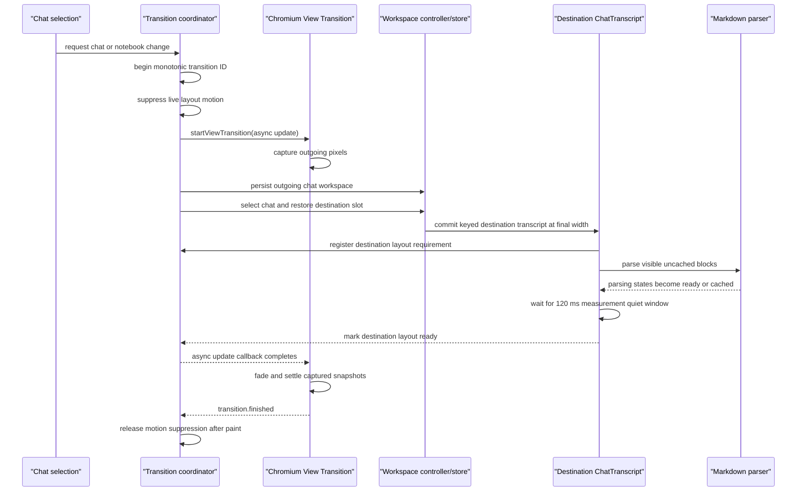

# Chat transcript flicker prevention

This document describes the system that keeps chat and Bench **transitions**
visually stable without breaking transcript virtualization, bottom anchoring,
detached reading positions, streaming, or workspace restoration.

It covers switching between chats and workspaces. Flicker *within* a single
streaming turn is a different problem with a different owner — see
[scroll-and-virtualization.md](./scroll-and-virtualization.md).

The central rule is:

> Commit live layout at the destination's final geometry, but show the outgoing pixels until that
> destination is ready. Animate captured pixels, never the live transcript's width.

## Scope

The system covers:

- switching between chats in the same notebook;
- switching notebooks;
- switching between chats with different saved Bench states;
- cold Markdown parsing and virtual-row measurement;
- initial workspace hydration after reload;
- opening and closing the left sidebar or docked Bench;
- manually resizing panes;
- restoring attached and detached transcript positions;
- paginating history around compaction boundaries; and
- rapid, superseding chat selections.

It does not replace TanStack Virtual's measurement or scrolling model. It coordinates when the
result becomes visible.

## Why the flicker happened

A transcript row's height depends on the conversation width. A single long Markdown response can
change by thousands of pixels when the right Bench or left sidebar changes that width.

The old failure sequence was:

1. Select a chat whose saved workspace geometry differs from the current chat.
2. Render the destination transcript at an intermediate width.
3. Parse Markdown and measure virtual rows at that width.
4. Animate the live pane width for roughly 200 ms.
5. Remeasure rows on several frames while bottom anchoring writes new scroll offsets.

This exposed raw Markdown, empty parsing states, incorrect virtual estimates, repeated text reflow,
and scroll corrections as full-window flashes.

Several attempted mitigations made different parts worse:

- delaying or remounting the virtualizer discarded warm measurements and destabilized autoscroll;
- a blank curtain hid bad geometry but created a blank frame;
- restoring an attached chat's old pixel offset landed above the semantic bottom;
- restoring a prepend anchor in an attached chat pinned the compaction divider;
- rendering complete historical Markdown as raw text before parsing produced enormous temporary
  row heights; and
- calling `ViewTransition.skipTransition()` retained the correct outgoing frame but removed the
  final fade and exposed the destination geometry as a hard snap.

The current system fixes the visibility boundary while preserving the established virtualizer.

## Ownership

| Concern | Owner | Contract |
| --- | --- | --- |
| Chat-change transaction | `packages/web/src/lib/active-chat-transition-coordinator.ts` | Serialize selection, persist the outgoing workspace, restore the destination workspace, and wrap the update in a native view transition |
| Transition identity and readiness | `packages/web/src/lib/active-chat-transition-state.ts` | Only the latest transition can wait, mark ready, or release motion suppression |
| Destination transcript readiness | `packages/web/src/components/chat/chat-transcript.tsx` | Register during the first layout effect and report ready only after loading, Markdown parsing, and row measurements settle |
| Markdown parse visibility | `packages/web/src/components/markdown/markdown-html-segment.tsx` | Expose `parsing`, `ready`, and `cached` states; do not install a raw fallback for complete historical Markdown |
| Virtualization and scroll anchoring | `ChatTranscript` and `useAutoScroll` | Keep the normal TanStack Virtual lifecycle; preserve semantic bottom and detached reading positions |
| Per-chat Bench restoration | `DirectoryWorkspaceController` and the directory workspace store | Save the outgoing slot and restore the selected chat's route, drawer, visibility, and layout |
| Live pane geometry | `DirectoryChatShell` and `DirectoryChatBenchPageLayout` | Apply transcript-affecting width changes without CSS width/right transitions |
| Transition appearance | `packages/web/src/bench-view-transitions.css` | Fade and settle captured chat/Bench snapshots over 240 ms; honor reduced motion |
| Drag throughput | `packages/ui/src/components/ui/resize-handle.tsx` | Coalesce pointer movement to at most one layout write per animation frame |

## Chat-switch lifecycle

### 1. Begin one authoritative transition

Every supported entry point routes through the shared coordinator:

- activate a notebook;
- start a draft;
- start, select, or fork a session;
- select a session and present a Bench target; or
- run another prepared active-chat mutation.

`beginActiveChatTransition()` assigns a monotonically increasing ID, resolves obsolete readiness
waiters, clears prior release state, and suppresses layout motion. The coordinator serializes the
actual transactions so two selection requests cannot mutate workspace state concurrently.

Every asynchronous boundary checks `isActiveChatTransition(id)`. An older request that loses the
race becomes `superseded` and cannot reveal or release the newer request.

### 2. Retain the outgoing Electron frame

When the document is visible and supports `document.startViewTransition`, the coordinator runs the
entire chat/workspace update inside its asynchronous update callback.

Chromium captures the outgoing document before invoking that callback. Rendering of the live
destination is suppressed while the callback is pending, so React, Markdown parsing, TanStack
Virtual measurement, and scroll repair can run without exposing their intermediate states.

The callback does not finish until `waitForActiveChatDestinationLayout(id)` resolves.

The coordinator then awaits `transition.finished`. It deliberately does not call
`skipTransition()`: the captured old and new states receive the product's 240 ms fade/settle.

This is different from delaying one or two animation frames. A fixed paint delay cannot know
whether an uncached Markdown worker, pagination, or a large virtual row has finished. The readiness
signal is tied to the actual destination work.

### 3. Restore workspace state inside the retained frame

Before selecting the destination, the coordinator asks the live source workspace to
`prepare-chat-change`. This:

- gives blockers such as an unsaved whiteboard a chance to stop navigation;
- stores the outgoing chat's route and presentation;
- persists the outgoing workspace; and
- clears the old active-session context while the handoff is in progress.

For a same-notebook switch, the same controller restores the destination chat's saved slot. For a
cross-notebook switch, the coordinator reads the destination's persisted slot and navigates
directly to its saved route.

The session and its Bench route therefore change inside the same retained update. The live DOM
never needs to animate through “old chat at new width” or “new chat at old width.”

If mutation or navigation fails after preparation, the coordinator restores the prepared source
slot and session context.

### 4. Mount the destination at final geometry

`ChatTranscript` is keyed by `sessionID`, so a selected session gets a fresh transcript instance.
The surrounding workspace is already projecting the destination chat's saved left/sidebar/Bench
geometry when that transcript commits.

The transcript registers its transition ID in a layout effect. Registration is important:

- the coordinator yields one task after mutation so React can commit and register;
- a transition with no transcript is allowed to continue without waiting; and
- a transition with a registered transcript must receive readiness or reach the safety timeout.

### 5. Wait for real destination readiness

The destination transcript is ready when all of the following are true:

- transcript repository loading is complete;
- no visible Markdown root reports `data-markdown-parse-state="parsing"`; and
- no virtual-row size change has occurred for 120 ms.

Every accepted `resizeItem` change reschedules the quiet timer. Pending Markdown is polled on the
same interval. Once both are quiet, the transcript calls
`markActiveChatDestinationLayoutReady(transitionID)`.

The 2.5-second readiness timeout is a deadlock escape hatch, not the normal reveal mechanism. It
prevents a broken component or parser from holding the outgoing snapshot forever.

### 6. Animate only captured surfaces

The named view-transition surfaces are:

- `buddy-chat-conversation`; and
- `buddy-bench-surface`.

The root is also covered so titlebar, sidebar, and surrounding workspace pixels transition
cohesively.

`bench-view-transitions.css` applies a 240 ms
`cubic-bezier(0.22, 1, 0.36, 1)` transition. The chat snapshot clips overflow while its captured
rectangle changes.

These are browser-captured images. Their opacity and geometry can settle on the compositor without
changing the live transcript's width and without triggering virtual-row remeasurement on every
animation frame.

With `prefers-reduced-motion: reduce`, the transition duration becomes 1 ms.

## Live layout rules

The snapshot transition is for chat/workspace replacement. Live transcript-affecting layout follows
stricter rules.

### Sidebar and docked Bench toggles

Opening or closing the left sidebar or docked Bench applies its final width immediately.
`DirectoryChatShell`, the desktop titlebar spacer, the docked Bench host, and the docked
conversation host use no width, right, or grid-column transition.

This may sound less polished in isolation, but animating a live width forces every wrapped Markdown
line and every variable virtual row to reflow repeatedly. The captured chat-switch transition
provides polish where two whole workspace states are exchanged.

### Floating chat

Floating chat is an overlay and does not continuously change the transcript's available docked
width. Its transform/opacity motion remains enabled for ordinary direct user actions.

During an active chat transition, `suppressLayoutMotion` makes floating/drawer entrance motion
instant. This prevents a nested animation from competing with the outer captured transition.

### Divider dragging

Pointer input can arrive faster than the display refresh rate. `ResizeHandle` stores the latest
resize intent and flushes it at most once per `requestAnimationFrame`. The final pending intent is
flushed when resizing ends.

Dragging still performs real live layout because the user is directly controlling the dimension,
but redundant same-frame width writes are removed.

## Markdown parsing contract

Complete historical Markdown and actively streaming Markdown have different needs.

### Complete historical content

If parsed HTML is cached, it is patched into the DOM in a layout effect and marked `cached`.

If it is not cached, the root is marked `parsing` and remains without a raw-text replacement until
the parser produces sanitized HTML. The retained outgoing frame hides this cold parse during chat
selection.

Do not reintroduce a raw fallback for complete content. Raw Markdown can wrap radically differently
from parsed tables, code, math, tool output, and rich blocks. In one observed failure, a long row
temporarily expanded by roughly 24,600 px and then collapsed after parsing, forcing an equally large
bottom-scroll correction.

### Streaming content

Streaming content may use a sanitized raw fallback when no rendered content is available. That is a
deliberate continuity path for content the user is actively watching arrive, not a cold-history
measurement strategy.

Every Markdown root exposes:

- `parsing` while the worker is outstanding;
- `ready` after a successful or fallback parse; and
- `cached` when HTML was available synchronously from the cache.

The transcript readiness gate consumes this state directly.

## Virtualization and autoscroll invariants

The flicker system does not replace or remount TanStack Virtual to hide layout changes.

The existing virtualizer keeps:

- stable domain row keys;
- the existing `ScrollArea` viewport as its scroll element;
- the session-scoped measurement cache;
- variable-height `measureElement` measurement;
- overscan and pinned active ranges; and
- the existing streaming and bottom-repair behavior.

### Attached is semantic, not a saved pixel

An attached transcript means “follow the current virtual end.” It does not mean “restore the last
numeric `scrollTop`.”

`useAutoScroll.initialScrollOffset()` therefore returns:

- `undefined` for an attached session, causing the virtualizer to seek the semantic end; and
- the saved pixel offset for a detached session, preserving the user's reading position.

Restoring an old attached pixel offset against fresh estimates can land in the middle of the chat
until measurement completes, which is why attached offsets are intentionally not durable.

### Detached readers keep ownership

Wheel-up, Page Up, Shift+Space, Home, touch-up, or an explicit interaction detaches the reader.
While detached:

- the exact session-scoped reading offset is restored on return;
- browser overflow anchoring is enabled;
- size changes above the first visible virtual row may adjust position; and
- bottom repairs do not pull the reader down.

Returning to the bottom or using “jump to latest” reattaches the session.

### Attached row measurement

While attached, TanStack Virtual **does** adjust scroll position for item-size
changes: its `wasAtEnd` branch runs before Buddy's
`shouldAdjustScrollPositionOnItemSizeChange` predicate and takes precedence.
Buddy owns only row appends and a gated trailing repair. All repair paths stop
when a real scroll gesture is active.

[scroll-and-virtualization.md](./scroll-and-virtualization.md) is authoritative
on this split; do not restate it here.

Viewport-height changes are handled in `ResizeObserver`, after layout and before paint. A shrinking
viewport receives the required bottom correction synchronously, and any perceived settle is replayed
with a compositor transform rather than an animated height.

## Compaction and history pagination

A compaction-only user message does not create an empty user row. The timeline projects only the
`SESSION COMPACTED` divider plus the visible assistant summary. This removes a zero-height row that
could accidentally become the first visible anchor.

When older history is prepended:

- a detached reader captures the first visible domain row and restores its viewport offset;
- the restoration stops after stable measurement or its frame limit; and
- any wheel, touch, pointer, or keyboard input cancels restoration immediately.

An attached reader never restores that prepend anchor. The semantic bottom remains authoritative.
This prevents the compaction divider from being held near the top for dozens of frames and prevents
the “scroll-up is stuck” interaction.

## Reload and hydration

Reload is the one place where the transcript waits before mounting.

Before directory workspace hydration completes, `DirectoryWorkspaceRoot` renders only a stable
workspace background. Once the persisted presentation is known, the transcript mounts once at the
correct sidebar and Bench geometry.

This is intentionally different from chat switching:

- on reload, no live transcript instance exists yet, so one correct mount is cheapest;
- on chat switch, the browser retains the outgoing pixels while the destination mounts and settles.

Mounting a full-width transcript before workspace hydration and then applying persisted Bench width
would recreate the original cold-load reflow.

## Concurrency and fallback behavior

### Rapid selections

Starting a newer transition:

- increments the authoritative ID;
- resolves stale layout waiters;
- clears stale readiness state; and
- prevents older async work from restoring or revealing over the new selection.

The mutation transactions remain serialized, but only the latest ID may complete as authoritative.

### Unsupported or hidden documents

If `document.startViewTransition` is unavailable, the document is hidden, or code is executing
outside a browser, the coordinator performs the same update directly.

This removes the retained visual treatment, not correctness. Workspace persistence, session
selection, virtualization, and scroll semantics still run.

### Failure recovery

Workspace blockers return `blocked` before chat mutation. Mutation, navigation, or presentation
errors return `failed`. A source workspace that was already prepared is restored so it does not
remain on a transient chat key or in a permanently transitioning state.

## Constants and their meaning

| Constant | Value | Purpose |
| --- | ---: | --- |
| `TIMELINE_INITIAL_LAYOUT_QUIET_MS` | 120 ms | Required quiet time after the latest row-size change and the polling interval for pending Markdown |
| `ACTIVE_CHAT_LAYOUT_READY_TIMEOUT_MS` | 2,500 ms | Safety release if a registered transcript never reports readiness |
| View-transition duration | 240 ms | Fade/settle of captured root, chat, and Bench surfaces |
| Attached-bottom threshold | 20 px | Reattach when the reader returns near the transcript end |
| Scroll gesture window | 250 ms | Prevent programmatic bottom repair from competing with current user input |
| Programmatic-scroll marker lifetime | 1,500 ms | Distinguish expected scroll writes from user detachment |

Change these values only with an Electron trace and a visual switch test. They coordinate separate
subsystems and should not be tuned independently as cosmetic constants.

## Anti-patterns

Do not:

- animate live transcript `width`, `right`, grid columns, or pane geometry;
- wait an arbitrary number of paints instead of using destination readiness;
- blank or unmount the whole conversation while the destination loads;
- call `skipTransition()` after the destination becomes ready;
- restore an attached session from a saved numeric offset;
- let prepend-anchor restoration run while the reader is attached;
- let anchor restoration compete with explicit wheel, touch, pointer, or keyboard input;
- render complete uncached Markdown as raw text before parsing;
- add a second row-measurement pipeline around TanStack Virtual;
- key virtual rows by array index; or
- validate this interaction only in the web browser.

## Diagnostics

The transcript performance trace is useful for separating failure classes:

- `row-size` identifies unstable virtual measurements;
- `scroll-write` shows requested and effective offsets;
- `render-state` includes Markdown phase and parse state;
- `visible-row-mount` and `visible-row-unmount` expose remount churn;
- `layout-shift` identifies pane and transcript rectangle changes;
- `geometry-settlement` reports prepend-anchor stabilization; and
- RAF gaps and long tasks identify renderer stalls.

Interpret layout events in context. The live destination is expected to perform one real geometry
change inside the suppressed View Transition update. The acceptance criterion is that intermediate
geometry is not painted, the final scroll state is correct, and measurements become quiet before
the captured transition reveals it.

Useful signatures:

- repeated large row deltas after the transition begins usually indicate width animation or an
  unstable content fallback;
- repeated `Number.MAX_SAFE_INTEGER` scroll requests indicate the attached virtual end is being
  sought while estimates are still changing;
- a compaction row used as a multi-frame geometry anchor indicates attached/detached ownership is
  wrong; and
- a chat rectangle changing directly from narrow Bench width to full width with no captured
  transition indicates the native transition was skipped or bypassed.

## Verification

The visual acceptance test must run in the packaged development Electron shell because its window,
titlebar, compositor, and Chromium View Transition behavior are part of the system.

At minimum, verify:

1. Switch from a long chat with docked Bench open to a chat with Bench closed.
2. Switch back from Bench closed to Bench open.
3. Repeat with an uncached long Markdown response.
4. Open a compacted chat and confirm it lands at the real tail.
5. Press Page Up or wheel upward and confirm movement begins immediately.
6. Rapidly select two or more chats and confirm only the last selection wins.
7. Reload a chat with persisted Bench geometry and confirm no full-width transcript paints first.
8. Toggle each sidebar directly and confirm there is one live geometry change, not a multi-frame
   reflow.
9. Drag each divider and confirm updates are responsive without redundant same-frame writes.
10. Enable reduced motion and confirm the retained frame does not produce a visible animation.

Relevant automated coverage lives in:

- `packages/web/test/active-chat-transition-coordinator.test.ts`;
- `packages/web/test/active-chat-transition-entrypoints.test.ts`;
- `packages/web/test/active-chat-transition-state.test.ts`;
- `packages/web/test/directory-chat-layout-motion.test.tsx`;
- `packages/web/test/use-auto-scroll.test.tsx`;
- `packages/web/test/chat-timeline-rows.test.ts`;
- `packages/web/test/resize-handle.test.tsx`; and
- workspace controller, workspace context, and floating-layout tests.

## Maintenance checklist

For any change that affects chat selection, transcript mounting, Markdown projection, pane geometry,
or scroll restoration:

1. Keep all chat-changing entry points on the shared coordinator.
2. Confirm workspace preparation and restoration still happen inside the retained update.
3. Confirm the destination transcript registers before the coordinator decides no wait is needed.
4. Confirm every asynchronous visible Markdown path exits `parsing`.
5. Confirm row-size changes reschedule readiness.
6. Preserve attached semantic-bottom and detached pixel-offset semantics.
7. Preserve gesture cancellation for both bottom repairs and prepend restoration.
8. Keep live transcript-affecting layout transitions disabled.
9. Keep the native captured fade/settle enabled.
10. Run focused tests, repository lint, and an actual Electron switch trace before considering the
    change complete.
