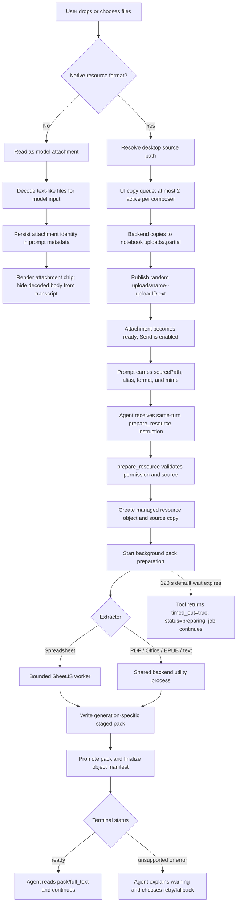

# Prepare Resource Design

## Status

This document describes the upload and `prepare_resource` path as implemented on 22 July 2026.
It covers the complete critical path from a desktop file drop through notebook upload, prompt
handoff, managed-object creation, extraction, resource-pack persistence, and agent consumption.

The current product decision is intentional:

- native resource preparation is agent-initiated;
- message generation does not wait for every attachment to be parsed first;
- the agent can observe preparation, explain parser failures, and choose a fallback;
- backend mechanism must still be durable, idempotent, bounded, and truthful.

Agent-led preparation is not the same as nondurable preparation. Buddy should preserve the current
low-latency conversation flow while making repeated calls refer to one logical resource job.

Related documents:

- [PDF parsing design](../pdf-parsing/design.md)
- [PDF parsing known issues](../pdf-parsing/known-issues.md)
- [Prepare-resource known issues](./known-issues.md)
- [Minimal hardening plan](./minimal-hardening-plan.md)

## Product Invariants

1. Attaching a native resource must not block the start of message generation on extraction.
2. The source selected by the user is never modified by preparation.
3. A successfully uploaded source is copied again into Buddy-managed object storage before parsing.
4. Failures before Send are UI-owned because the agent has not received a message yet.
5. Failures after `prepare_resource` starts are tool-visible so the agent can explain them.
6. A caller wait timeout is not a parser execution timeout and must not falsely mark slow work as
   failed.
7. One logical upload should map to one logical resource object and preparation job. This is the
   intended invariant, but the current implementation does not yet satisfy it.
8. Every started preparation should eventually be durably observable as `ready`, `unsupported`, or
   `error`, unless it is genuinely still executing. The current implementation has an outer-error
   gap that can leave `preparing` forever.
9. macOS and Windows packaged builds are both release targets. Source-level portability is not
   sufficient evidence for this path.

## Resource Classes

Buddy has two attachment paths with different ownership and failure behavior.

| Class | Examples | Transport | Preparation |
| --- | --- | --- | --- |
| Model attachment | images, text, Markdown, JSON, code | Data URL or provider file part | No managed resource is created automatically |
| Native resource attachment | PDF, EPUB, DOCX, PPTX, XLSX, XLS, XLSM, XLSB, ODS, Numbers | Desktop path copied into the notebook, then referenced by path in the prompt | Agent calls `prepare_resource` |

PDF uses `model-and-resource` delivery: the provider may receive the PDF directly while Buddy also
offers the managed preparation path. Other native formats use `resource-only` delivery.

Text-like model attachments are decoded into model-readable prompt text. They now retain structured
`text-file-attachment` metadata, so the transcript renders a file chip instead of the entire decoded
body. The body remains in model input. Existing messages saved before that metadata existed are not
retroactively reclassified.

`prepare_resource` itself accepts a wider set of source paths than the native drop path. An agent can
prepare supported HTML, Markdown, text, CSV, JSON/YAML, and code files already available in the
workspace. The desktop upload path is restricted to the native resource formats listed above.

## Current End-To-End Pipeline

## Stage Ownership And Behavior

### 1. Renderer intake

The composer classifies files using the shared workspace-file policy. Native resource attachments
start in `copying`; Send remains unavailable while a native copy is incomplete or failed. The
renderer asks Electron for the real desktop path instead of loading native documents as base64.

The copy queue in
[`use-prompt-composer-attachments.ts`](../../../packages/web/src/components/prompt/use-prompt-composer-attachments.ts)
allows two active native copies per composer. Removing a chip aborts the HTTP request and invalidates
that UI generation. This prevents stale completion from re-adding the chip, but it does not prove
that an already-running filesystem copy stopped in the backend.

Failures at this stage must be explicit UI errors. The current chip provides retry/remove behavior,
but most backend filesystem failures are collapsed into a generic copy failure.

### 2. Notebook upload

[`notebook-upload-service.ts`](../../../packages/buddy/src/notebook-uploads/notebook-upload-service.ts)
performs the first local copy:

1. resolve and stat the source;
2. require a regular file and supported native extension;
3. reject a source larger than 64 MiB;
4. copy to a UUID-named `.partial` file under `<notebook>/uploads` with no overwrite;
5. stat the copied file and recheck the 64 MiB limit;
6. publish `safe-name--<10-character-uploadID>.<extension>` with a hard link;
7. unlink the partial name and return both workspace and absolute paths.

Publication makes the final name appear atomically and retries a random-name collision up to 32
times. It currently requires hard-link support. There is no copy deadline, byte-counted streaming
abort, free-space preflight, or global copy semaphore.

### 3. Prompt handoff

Only ready native attachments are submitted. The backend revalidates count, strings, extension,
source existence, and lexical containment under `<notebook>/uploads` in
[`native-resource-attachments.ts`](../../../packages/buddy/src/learning/prompt/native-resource-attachments.ts).

The web attachment state contains `uploadID`, but the submitted native-resource part currently keeps
only `sourcePath`, filename, alias, format, and MIME. The random upload ID remains embedded in the
published filename, but it is not a first-class preparation identity.

The Buddy prompt prelude tells the agent to call `prepare_resource` once for every native resource.
This preserves the intended fast start and agent-led policy, but the instruction currently carries
more correctness responsibility than it should because repeat calls are not idempotent.

### 4. Resource registration

`prepare_resource` authorizes the source path, asks for tool permission, then calls `addResource`.
Registration:

- validates source existence, file type, size, and reader signature where applicable;
- allocates a new resource object ID and unique alias;
- records an immutable original source reference when it is inside the workspace;
- copies the upload into `.buddy/objects/v1/resource/<objectID>/source/`;
- writes a `preparing` object manifest through an object staging directory and rename;
- starts preparation in the background.

The managed source isolates parsing from later edits to the uploaded file. It also means a legal
64 MiB source may temporarily or persistently exist at least twice before derived output is counted.

Every `addResource` call currently allocates a new object. In-process preparation is deduplicated by
`directory + objectID`, not by upload or source identity.

### 5. Tool waiting

The tool polls the object manifest every 500 ms. With `waitUntilReady=true`, it waits 120 seconds by
default; callers may request between 500 ms and 600 seconds.

When the wait expires:

- the preparation is not cancelled;
- the object remains `preparing`;
- the tool returns `timed_out=true` and tells the agent that work is still running.

If the tool call is aborted, polling stops, but the background preparation continues. These are
observation semantics, not an execution watchdog.

### 6. Extraction and pack construction

Preparation writes into a generation-specific staging pack. The extractor produces bounded full
text, pages, chunks, cover data, and text artifacts. Pack files are written before metadata is
finalized. A generation check prevents a stale build from updating a newer manifest.

Ordinary extraction exceptions are caught by
[`resource-packs/service.ts`](../../../packages/buddy/src/resource-packs/service.ts) and converted into
error pack metadata containing the exception message. Those failures are scoped to the resource and
are normally explainable by the agent.

After a staged build, the registry removes the current pack directory, renames the staged directory
into place, reads the result, and finalizes the object manifest. Errors outside the extractor catch
can escape this sequence. The outer scheduler currently swallows those errors, which is the source
of the permanent-`preparing` failure mode.

### 7. Consumption

The tool returns object ID, alias, status, warnings, managed-source path, reader path, pack path, and
full-text path. The agent chooses whether to read the whole document, a pack entry, a page/chunk, or
use another strategy. This is the policy boundary that should remain nondeterministic and
agent-owned.

## State Model

| State | Meaning | Terminal? |
| --- | --- | --- |
| UI `copying` | Desktop source path is being copied into notebook uploads | No |
| UI `error` | Pre-send copy or path resolution failed | Yes until user retries/removes |
| UI `ready` | Published notebook upload exists and can be sent | Yes for upload stage |
| Resource `preparing` | Managed object exists and pack work is expected to be active | No |
| Resource `ready` | A usable pack was prepared | Yes |
| Resource `unsupported` | Extraction completed but did not yield supported usable content | Yes |
| Resource `error` | Validation, parsing, budget, or persisted preparation failure | Yes |
| Resource `stale` | Original workspace source changed after a ready build | Requires rebuild decision |

`timed_out=true` is not a resource state. It means only that one tool invocation stopped waiting.

## Execution Boundaries

| Boundary | Current role | Containment |
| --- | --- | --- |
| Renderer | Composer state, desktop drop, model attachment decoding | Native resources avoid renderer base64 loading |
| Electron main process | Desktop bridge and backend lifecycle | Separate from backend parsing |
| Backend utility process | Upload API, object registry, most extraction, pack writes, sessions | A crash does not directly crash the renderer, but all local APIs stop |
| SheetJS worker thread | Spreadsheet archive validation, parsing, CSV/full-text staging | Bounded concurrency, active timeout, V8 heap limits; not an OS memory boundary |
| LiteParse/Tesseract | PDF native extraction, complexity analysis, selective OCR | Runs under the shared backend path; no Buddy cancellation or wall-clock execution timeout |
| PDF fallback commands | `pdftotext`, `mutool`, `pdftoppm` | Child processes have output-buffer limits but no execution timeout |

Electron logs backend utility termination but does not currently restart it. A shared-backend crash
therefore affects every session, upload, and preparation until Buddy is relaunched.

## Current Hard Limits

### Upload and prompt

| Limit | Value |
| --- | ---: |
| Native source size | 64 MiB |
| Native attachments per prompt | 8 |
| Active native copies per composer | 2 |
| Upload publish collision attempts | 32 |
| Sanitized upload stem | 120 characters |
| Native attachment filename | 255 characters |
| Native attachment alias | 255 characters |
| Native attachment source path | 4,096 characters |

### Generic archive and extracted output

| Limit | Value |
| --- | ---: |
| Archive entries | 4,096 |
| Generic archive expanded bytes per entry | 32 MiB |
| Generic archive aggregate expanded bytes | 128 MiB |
| Full text | 16,000,000 characters |
| Pages | 5,000 |
| Chunk units | 10,000 |
| Text artifacts | 256 |
| Aggregate text artifact content | 32,000,000 characters |
| Text artifact relative path | 240 characters |

The full-text command buffer for PDF fallbacks is derived from the 16-million-character budget and
is currently 48 MiB. PDF cover command output is capped at 32 MiB.

### Spreadsheet-specific

| Limit | Value |
| --- | ---: |
| Worksheets | 256 |
| Rows per worksheet | 100,000 |
| Columns per worksheet | 256 |
| Non-empty cells per workbook | 1,000,000 |
| Materialized rectangular cells | 2,000,000 |
| Row-window size | 50 rows |
| Spreadsheet archive expanded bytes per entry | 128 MiB |
| Spreadsheet archive aggregate expanded bytes | 128 MiB |
| Active workers | 1, or 2 when host memory and CPU permit |
| Waiting spreadsheet jobs | 32 |
| Active worker execution timeout | 300 seconds |
| V8 old-generation limit per worker | 512 MiB |
| V8 young-generation limit per worker | 64 MiB |
| Stale spreadsheet temp cleanup threshold | 24 hours, checked on a later parse |

The V8 limits do not cap buffers, native allocations, external memory, the parent process, or total
RSS. The parent reads staged full text and CSV artifacts back into memory after the worker exits.

### PDF and OCR

| Limit | Value |
| --- | ---: |
| PDF pages | 5,000 |
| Automatic targeted OCR pages | 10 |
| LiteParse worker count per invocation | 1 |
| Buddy wall-clock OCR execution timeout | None |
| Buddy OCR cancellation hook | None |

When more than 10 pages are selected for OCR, Buddy skips the targeted OCR pass. If native text is
usable, preparation succeeds with an explicit warning; otherwise the extraction falls through the
existing failure/fallback behavior. Buddy does not OCR an arbitrary first 10 pages.

### Tool observation

| Limit | Value |
| --- | ---: |
| Poll interval | 500 ms |
| Default wait | 120 seconds |
| Maximum requested wait | 600 seconds |
| Effect of wait expiry | Return `preparing`; execution continues |

## Current Containment Summary

The strongest containment is at file publication boundaries:

- native uploads use random final names and no-overwrite partial copies;
- managed objects are constructed in staging before first publication;
- preparation uses generation-specific staging;
- old generations cannot finalize a newer manifest;
- ordinary extraction errors become one resource's error metadata;
- SheetJS work is off the backend event loop and large output crosses through staged files.

The weakest containment is orchestration and shared execution:

- repeat preparation creates duplicate objects;
- outer finalization failures can be swallowed;
- OCR has neither progress nor a killable Buddy-owned execution boundary;
- non-spreadsheet preparations have no global scheduler;
- pack writes can fan out to thousands of concurrent filesystem promises;
- there is no aggregate derived-pack size, notebook quota, or storage lifecycle;
- backend utility death is not recovered automatically.

The prioritized remediation is defined in [the minimal hardening plan](./minimal-hardening-plan.md).
