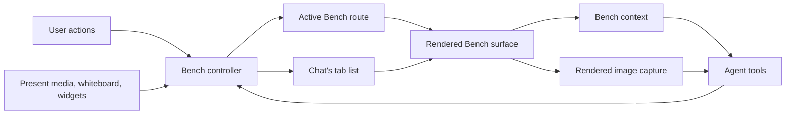

# Buddy Bench Tabs — System Design

## Overview

Buddy's right workspace currently shows one Bench target at a time. Bench tabs let one chat keep
several targets open and move between them without losing the user's place.

A target can be:

- a file;
- a resource or book;
- a Buddy object such as a diagram, figure, question set, or flashcard deck;
- a whiteboard;
- an HTML widget;
- another surface that already renders on Bench.

Tabs are shared by the user and the agent. A file opened from Explorer, an object shown by
`bench_present`, and media automatically presented by a tool all enter the same tab system.

The central rule is:

> Buddy has one Bench tab system. The user and the agent use different controls, but they act on
> the same tabs and the same visible Bench surface.

## The Mental Model

Each chat owns an ordered list of tabs.

Each tab points to one Bench target:

```text
Tab
 ├─ stable key
 └─ Bench target
```

The selected tab is the target currently shown on Bench. Only that selected tab is visible to the
user and readable by the model.

```text
Chat
 ├─ notes.md
 ├─ Biology diagram       ← selected
 └─ Chapter flashcards
```

The other tabs stay open, but they are inactive.

## End-to-End Architecture



There are six important parts:

1. **Tab list** — remembers which targets are open and their order.
2. **Bench controller** — handles every open, focus, close, and restore request.
3. **Route** — identifies the selected target.
4. **Surface host** — renders the selected target and keeps recent inactive surfaces alive.
5. **Bench context** — tells the model what tabs exist and what the selected tab contains.
6. **Capture service** — captures an image of the selected Bench surface when requested.

## Ownership

The system has one owner for each idea:

| Idea | Owner |
| --- | --- |
| Which tabs are open | The active chat's tab state |
| Tab order | The active chat's tab state |
| Which tab is selected | The active Bench route |
| Opening, focusing, and closing tabs | The Bench controller |
| File, object, or whiteboard data | The feature that created it |
| Which surfaces remain mounted | The Bench surface host |
| What the model can read | Bench context |
| What rendered pixels the model can see | Bench capture |

The selected tab is not stored twice. The route says which target is selected, and the tab strip
derives its selected state from that route.

## Opening and Focusing Tabs

All presentation paths follow the same rule:

> If the target already has a tab, focus it. Otherwise, open a new tab and focus it.

This applies when:

- the user selects a file in Explorer;
- the user opens something from Library;
- the user clicks a Bench presentation in the transcript;
- the agent calls `bench_present`;
- another tool presents media, a whiteboard, or an HTML widget.

This prevents duplicate tabs for the same target while preserving other open work.

Best-effort auto-open has narrower focus rules. The first Whiteboard authoring event for the active
chat in an agent message focuses or opens its tab so the user can see the work begin. Later
Whiteboard events in that same message may update tabs but do not pull focus back if the user has
moved away. Auto-open for an inactive chat never switches chats. A fullscreen HTML widget presented
for the active chat focuses its tab so the user can see that it was created; one presented for an
inactive chat remains backgrounded with that chat.

### Example

The user has `notes.md` open. The agent generates a diagram.

```text
Before:  [notes.md]
After:   [notes.md] [Cell diagram]
                            ↑ selected
```

If the agent presents `notes.md` again, Buddy focuses the existing `notes.md` tab instead of
opening another copy.

## How the Agent Uses Tabs

The agent uses two Bench tools.

### `bench_present`

`bench_present` changes what is visible.

It can:

- present a file, resource, object, or whiteboard;
- focus an existing tab using its tab key;
- close Bench when the user asks.

Presenting a target either focuses its existing tab or opens a new one.

Focusing by tab key returns to that exact open tab without resolving or recreating the target.

### `bench_read_context`

`bench_read_context` reads the current Bench state, including parked tabs without revealing them.

It returns:

- a bounded list containing the selected tab and recently opened tabs, or matching tabs when the
  optional `tabSearch` parameter is provided;
- each returned tab's current one-based position, title, and stable tab key; only the selected tab
  is marked selected and includes a compact target plus its absolute local path for follow-up
  tools;
- the total open-tab count, plus matching or omitted counts only when they add information;
- the selected tab's model-readable content when Bench is visible;
- an optional image of the selected rendered surface.

The model-facing projection removes client-only routing and identity fields such as the canonical
target key, workspace root, rendered route, and repeated full targets on inactive tabs. The rich
snapshot remains internal for validated capture and exact focus actions.

It does not return the full contents of inactive tabs. The agent focuses another tab before reading
that tab's content. Buddy retains every open tab internally, but the tool returns at most 20 tab
summaries. Search covers the complete internal tab list and never focuses or reveals a tab.
Tab numbers reflect the current visible ordering and may change after tabs close; `bench_present`
continues to focus tabs only by exact tab key.

### Agent flow

```text
1. Read Bench
   → tabs: notes.md, Cell diagram
   → selected: Cell diagram

2. Focus notes.md using its tab key
   → Buddy visibly switches to notes.md

3. Read Bench again
   → returns notes.md context

4. Optionally request an image
   → returns what notes.md currently looks like on Bench
```

The user sees agent-driven tab switches. This is intentional: the selected tab represents the one
shared piece of Bench that both the user and the agent are working with.

On desktop, the tab strip uses the available titlebar row in both docked and immersive layouts. In
browser environments without the Electron titlebar, immersive tabs remain inside the workspace.

## Reading and Capturing a Tab

Text context and rendered images answer different questions:

- **Context** tells the model what the selected target means: content, metadata, references,
  selection, and surface status.
- **Capture** tells the model what the selected target currently looks like: layout, canvas state,
  zoom, scroll position, media frame, visual output, and any drawer currently covering it. The
  returned context identifies that drawer so the model can interpret the composited pixels.

The model may request context only, context plus an image, or only the temporary image path. Image
captures still use context internally to validate selected-tab and drawer identity even when that
context is omitted from the tool result. Screenshot results also include a lightweight capture
receipt with the capture time, canonical target key, target title, and drawer state so the durable
transcript remains interpretable after the temporary PNG is cleaned up.

For a specific tab, the model first focuses that tab and then reads or captures it. This keeps tab
switching explicit and prevents a read operation from silently changing the user's workspace.

### Capture flow

```text
Agent requests image
  → Buddy confirms Bench is visible
  → Buddy records the selected tab
  → selected surface finishes rendering
  → frontend captures the full visible right workspace, including tabs, drawer, and rail
  → Buddy confirms the tab did not change
  → context and image return together
```

The frontend performs the capture because it owns the real rendered pixels. This is important for
whiteboards, video, iframes, readers, zoomed documents, and other content that cannot be recreated
accurately from data alone.

If the selected tab changes during capture, Buddy does not return a potentially incorrect image.
The request fails cleanly and the agent can read the current Bench again.

## Model Visibility

Only the selected, visible tab exposes its target and content to the model.

Inactive tabs appear as lightweight summaries:

```text
- one-based tab number
- tab key
- title
```

Their target identity and full content are not included. The selected entry is marked selected and
adds the compact target plus its absolute local path for follow-up tools.

This keeps context small and avoids mixing several files, diagrams, readers, or editors into one
answer. It also preserves a simple shared truth:

> The model sees the same Bench target the user sees.

When the right workspace is collapsed, the tabs remain open but Bench context reports that the
surface is not visible.

## Rendering and Memory

An open tab does not always need a permanently mounted React surface.

Buddy already has a Bench surface host that can keep a limited number of recent surfaces alive.
Tabs use that system:

- the selected tab is active;
- recent inactive tabs may remain mounted;
- expensive older tabs may be removed from memory;
- selecting an evicted tab reconstructs its surface from its feature data and saved view state;
- closing a tab releases its cached surface.

This lets tabs feel fast without keeping every whiteboard, reader, widget, editor, and media player
alive forever.

The number of open tabs and the number of mounted surfaces are separate limits.

## Closing, Collapsing, and Restoring

These actions have different meanings:

| Action | Result |
| --- | --- |
| Close a tab | Remove that one tab |
| Close the selected tab | Select the tab on the right, otherwise the left |
| Close the final tab | Close Bench |
| Collapse the right workspace | Hide Bench but keep every tab |
| Reopen the right workspace | Show the previously selected tab |
| `bench_present` close | Close Bench and clear its tabs |
| Switch chats | Save this chat's tabs and restore the other chat's tabs |
| Restart Buddy | Restore persisted tabs for the chat |

Closing a tab never deletes the underlying file, object, resource, or whiteboard. It only closes
that view.

## Reliability

Tab actions keep Buddy's existing navigation guarantees.

### Unsaved work

Switching away from a dirty editor goes through the existing Bench leave guard. Buddy saves when
possible or blocks the switch. The new tab is not committed before the switch succeeds.

### Competing actions

If the user and agent act at nearly the same time, the Bench controller orders the commands. A
superseded command cannot later overwrite the newer tab or route.

### Tool acknowledgement

An agent presentation or focus request finishes only after:

1. the requested tab is selected;
2. its route is committed;
3. its surface is available;
4. Bench context describes that same target.

For a capture request, the returned image must also belong to that same selected tab.

### Tab and model-context limits

The user-facing tab list has no product count limit and Buddy never silently discards an open tab.
Mounted surfaces remain bounded independently from these lightweight tab descriptors. Model-visible
state is bounded instead: the automatic parked-Bench context includes the selected tab plus five
recently opened tabs, while `bench_read_context` returns at most 20 summaries and can search the full
internal list. Both identify returned tabs by their current one-based number and exact tab key.

## Patterns Taken From T3 Code

T3 Code provides the reference for the tab model and interactions:

- tabs are lightweight pointers, not owners of resource data;
- tabs are scoped to a conversation;
- opening the same resource reuses its tab;
- new tabs have predictable order;
- closing the selected tab chooses a nearby tab;
- the tab strip is a small presentational component;
- overflowing tabs scroll horizontally;
- the selected tab scrolls into view;
- titles truncate and show tooltips;
- hover and middle-click can close tabs;
- context actions include Close, Close Others, Close to the Right, and Close All;
- resource cleanup remains outside the tab component.

Buddy keeps its own stronger architecture:

- the route owns the selected target;
- the Bench controller owns every transition;
- the router guard protects dirty work;
- expensive Bench surfaces use bounded keep-alive;
- agent tools can discover, focus, read, and capture tabs;
- agent actions complete only after UI and model context agree.

We are borrowing T3's simple tab model and polished interactions, not copying its application
structure.

## Result

The finished system feels like one shared workspace:

- the user can keep several Bench targets open;
- the agent can present or focus any of them;
- presentation tools open or reuse the same tabs;
- the model can read the selected tab;
- the model can request an image of what the selected tab actually renders;
- switching tabs preserves state and protects unsaved work;
- collapsing, changing chats, and restarting Buddy restore the expected workspace.

There is no separate user tab system and agent tab system. There is one Bench, one selected tab, and
one shared view of what is happening.
