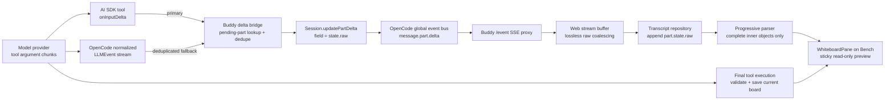

# Whiteboard Streaming

This document is the source of truth for Buddy's model-time progressive whiteboard
streaming. It describes the current architecture, the transient and durable data
paths, the July 2026 producer regression, and the August 2026 lifecycle and
subscription regressions that delayed or obscured progressive drawing.

The lifecycle is split by the streamed `objectID` value:

- `objectID: null` is a new-board request. Before authorization it may open a
  transient, non-routed preview that creates no object, reservation, route, or
  `.buddy` state. Denial removes the preview and reveals the previous target.
- a concrete `objectID` is an existing-board update. It never opens the
  objectless preview or replaces the populated board with the opening animation.
  The real board remains mounted while streamed elements compose over it.
- after `ctx.ask` succeeds, execution creates or resolves the directory-owned
  object and publishes its stable target. A new preview hands off to that target;
  an existing update continues on the already mounted target.

## Outcome

While the model generates a `whiteboard_create_view` call, Buddy incrementally
renders complete drawing elements from the still-incomplete tool arguments. The
learner can therefore see a heading, shape, arrow, or other safe partial frame
before the tool begins execution.

Progressive drawing is deliberately ephemeral:

- partial tool input is never a durable board;
- only the final parsed and validated drawing program may update the current board;
- a malformed or interrupted stream may leave a temporary preview, but it cannot
  corrupt persisted whiteboard state;
- for a new board, the opening animation exists only while the stream contains
  zero complete drawable elements; the first complete drawable replaces it
  immediately and later complete elements apply one by one;
- for an existing board, progressive rendering composes over the fetched board
  without hiding its current content;
- after authorization, a new-board object surface replaces its transient
  preview and continues progressive rendering against the stable object ID.

## Core Invariants

1. The transport reuses `message.part.delta`; there is no whiteboard-specific
   streaming endpoint.
2. Whiteboard argument fragments use the nested field name `state.raw`.
3. `message.part.delta` is transient. It is published to the live event bus and
   is not written to the session database.
4. The final tool part and final board are durable. A complete board appearing
   later does not prove that progressive deltas worked.
5. Only a pending `whiteboard_create_view` part may receive live raw fragments.
6. The AI SDK callback is the primary low-latency source. The normalized LLM
   stream remains a deduplicated fallback and covers the native LLM runtime.
7. A kept-alive Bench whiteboard consumes only active-chat tool parts that match
   its stable `objectID`; a new objectless preview consumes only its exact
   `messageID:part.id` tool key.
8. Partial rendering applies only complete inner-array objects and never persists
   them.
9. `part.id` is transcript/UI identity. `part.callID`/`ctx.callID` is backend
   tool-call identity. Neither may be substituted for the other.
10. Session-level message snapshots are structural and do not rerender for every
    raw delta. Active whiteboard UI subscribes directly to its live part IDs.

## Architecture at a Glance



The primary and fallback producer paths converge before the existing session
event contract. Everything after `Session.updatePartDelta` is shared with other
streamed message-part fields.

## End-to-End Flow

### 1. The streamed request selects one of two surface lifecycles

`whiteboard_create_view` uses an outer object with a string drawing program:

```json
{
  "boardAction": "continue_current_board",
  "elements": "[{\"type\":\"rectangle\",\"id\":\"frame\",\"x\":0,\"y\":0,\"width\":240,\"height\":120}]"
}
```

As soon as enough outer input exists to classify the call:

1. `objectID: null` opens a frontend-only transient preview for that tool key.
   This is deliberately before authorization so the learner gets immediate
   visual feedback, but it performs no durable or routed write.
2. a concrete `objectID` keeps or presents that real object. It does not put a
   transient empty surface in front of the existing canvas.
3. after authorization, execution creates or resolves the stable object,
   publishes Bench auto-open metadata for that target, and validates and applies
   the completed drawing program.
4. presentation is acknowledged only when the intended object is visibly
   committed. Retryable workspace-transition outcomes use bounded retries;
   inactive/background actions never activate their session.

Surface opening and partial drawing transport are independent. If a new-board
preview opens but no raw deltas arrive, it remains on `Opening whiteboard...`
until a complete drawable arrives or the lifecycle terminates. An existing
board must remain visible even when no raw delta arrives.

### 2. Startup installs the live bridge

`loadOpenCodeApp()` installs the bridge before `Server.Default()` constructs the
in-process OpenCode server.

The bridge obtains both the live Session service and the live LLM service from
the same memoized App runtime. It patches these shared instances once:

- the Session patch tracks pending whiteboard parts and their
  `sessionID`/`messageID`/`partID`/`callID` identity;
- the LLM patch wraps the whiteboard tool's AI SDK `onInputDelta` callback and
  observes the normalized LLM stream as a fallback.

Because server construction and patch installation are process-singletons, a
backend restart is required after changing this bridge.

### 3. The primary producer forwards AI SDK callbacks

For the default AI SDK runtime, the SDK invokes a tool's `onInputDelta` callback
before it enqueues the corresponding `tool-input-delta` into `fullStream`.

Buddy wraps only `whiteboard_create_view`:

1. preserve and invoke any existing `onInputDelta` callback;
2. reserve a callback receipt keyed by `sessionID` and `callID`;
3. resolve the pending tool part;
4. publish the fragment as:

   ```json
   {
     "sessionID": "ses_...",
     "messageID": "msg_...",
     "partID": "prt_...",
     "field": "state.raw",
     "delta": "{\"boardAction\":\"continue_current_board\",..."
   }
   ```

5. if publication fails, roll back the receipt so the normalized fallback can
   deliver the fragment later.

This callback is the latency-critical seam. Tests reproduce an SDK stream in
which multiple callbacks run before the first corresponding normalized
`fullStream` event is visible to its consumer.

### 4. The pending-part race is queued

The provider may begin emitting argument text before the processor's pending
tool-part update has reached the patched Session service.

When the callback cannot yet resolve a part, the bridge queues the receipt
instead of dropping it. The Session `updatePart` wrapper:

1. records the pending `whiteboard_create_view` part;
2. converts queued receipts into `state.raw` part deltas;
3. publishes them in arrival order.

Tracking is bounded:

- at most 256 pending whiteboard parts per session;
- at most 16,384 pending parts globally (64 times the per-session capacity);
- at most 4,096 unconfirmed callback fragments per tool part.

If the callback receipt bound is reached, later fragments are left for the
normalized fallback instead of growing memory without limit.

### 5. The normalized stream is a deduplicated fallback

OpenCode exposes normalized `tool-input-delta` events from both supported LLM
runtime paths.

For AI SDK streams, the normalized event usually represents a fragment already
published by `onInputDelta`. A FIFO callback receipt with the same fragment text
is consumed, and the normalized event is not published again.

If no matching receipt exists, the normalized event is forwarded. This covers:

- the native LLM runtime, which does not use the AI SDK tool callback;
- callback publication failures;
- callback receipt overflow;
- future providers or adapters that expose normalized deltas without invoking
  `onInputDelta`.

The vendored processor may still call `ensureToolCall` for normalized tool-input
deltas. Buddy does not depend on that processor to append `state.raw`.

### 6. Session events travel through the existing SSE path

`Session.updatePartDelta` publishes `MessageV2.Event.PartDelta`. It does not
update the session database.

The global event stream emits the event as `message.part.delta`. Buddy's
compatibility `/event` route proxies the in-process OpenCode `/global/event`
stream and preserves this payload while applying unrelated compatibility
transforms where needed.

The browser maintains one reconnecting SSE stream per directory. Incoming events
are normalized, session-fenced when necessary, buffered for a React frame, and
then applied in a batched update.

### 7. The web stream buffer preserves raw fragments

The stream buffer may coalesce adjacent deltas for the same part and field by
concatenating their strings. This is lossless.

Unlike text snapshot compaction, a later `message.part.updated` snapshot must
not cause a queued `state.raw` delta to be discarded. Pending and running tool
snapshots do not necessarily contain the accumulated transient raw string.

The transcript repository applies the nested field explicitly:

```text
part.state.raw = previousRaw + delta
```

It also supports a delta arriving while the part is still orphaned from its
parent message. Once the parent message arrives, the accumulated part joins the
normal transcript.

### 8. Whiteboard UI subscribes only to matching live parts

Raw `state.raw` fragments update the transcript repository's part-level store.
The session-level message snapshot intentionally does not publish a new React
snapshot for every raw fragment, because doing so would rerender the entire chat
at drawing-token frequency.

`useLiveWhiteboardMessages` bridges that boundary narrowly:

1. start with the active session's structural message snapshot;
2. find active `whiteboard_create_view` parts;
3. subscribe to only those part IDs through `useTranscriptParts`;
4. merge those live part snapshots back into the messages consumed by
   `WhiteboardPane` and `WhiteboardBenchAutoOpen`.

The progressive consumer then filters by stable `objectID` for a real board or
by exact `messageID:part.id` tool key for a new transient preview. A kept-alive
surface cannot consume another chat's transcript merely because it is mounted,
and unrelated transcript components do not rerender for each drawing fragment.

### 9. The progressive parser builds safe frames

The parser receives incomplete outer tool JSON such as:

```text
{"boardAction":"continue_current_board","elements":"[{\"type\":\"rectangle\"...
```

It performs two incremental parsing layers:

1. locate and decode as much of the outer JSON string argument `elements` as is
   currently valid, including escape sequences;
2. parse the longest valid prefix of the inner JSON array ending at a complete
   object.

Every complete drawable or control object applies immediately, including the
first and newest complete item. An incomplete object cannot pass the inner-array
parse, so it remains buffered without delaying earlier complete objects.
`cameraUpdate` affects the preview viewport but is never stored as a drawn
element. This lets the opening animation yield to the canvas on the first
renderable streamed element rather than waiting for a following element or the
durable-board handoff.

The parser then applies the program against:

- the fetched current board for `continue_current_board`; or
- an empty base for `destructively_replace_current_board`.

Only supported elements with stable IDs enter the preview. Repeated IDs are
ignored, and a signature prevents redundant Excalidraw scene work when no
complete drawable content changed.

### 10. WhiteboardPane owns the preview-to-durable handoff

`WhiteboardPane` derives a progressive preview from transcript messages and the
latest fetched board.

The preview:

- can create the first visible canvas before any durable board exists;
- is read-only and cannot trigger learner autosave;
- stays sticky across pending, running, and durable-refetch transitions;
- folds completed same-turn writes newer than the fetched board before applying
  the next pending program;
- does not replace a visible board with an empty control-only preview;
- reuses the pane-owned viewport and stable object canvas key.

When the final program executes, the backend validates it and saves the new
current board. The pane refetches when completed whiteboard call count changes
and once more on the busy-to-idle transition as a safety net. The durable board
then becomes the editable autosave baseline.

The object canvas stays mounted through that handoff. When the streamed and
durable element signatures match, `WhiteboardCanvas` republishes the exact
currently visible Excalidraw elements once with `CaptureUpdateAction.NEVER`.
That scene update forces Excalidraw's final high-quality render without
reconverting or repositioning figures. It uses the mounted-update path, which
does not apply persisted viewport state, fit content, change zoom or scroll, or
remount the canvas. The existing multi-frame settle then refreshes offsets and
re-arms autosave. If the durable element signature differs, the durable elements
replace the preview through the same viewport-preserving path.

## Transient and Durable State

| Data | Transport/storage | Durable | Purpose |
| --- | --- | --- | --- |
| Pending tool part | Session part update/event | Yes | Establish tool identity and lifecycle |
| `state.raw` fragments | `message.part.delta` over live event bus/SSE | No | Progressive preview input |
| Client accumulated raw | Transcript repository memory | No | Reconstruct partial outer arguments |
| Progressive elements | Whiteboard pane/Excalidraw memory | No | Immediate visual feedback |
| Completed tool input | Final tool part | Yes | Auditable final call |
| Current board | Directory-owned whiteboard object state | Yes | Editable learner-visible board |
| Render report | Current board support state | Yes | Measured layout feedback |

This distinction matters during incident analysis. The session database can
confirm the pending/running/completed lifecycle and final tool input, but it
cannot count or disprove transient `message.part.delta` delivery.

## August 2026 Lifecycle And Subscription Regressions

Two regressions established boundaries that are now contractual:

1. The transient new-board preview was briefly activated for every create-view
   call. Existing-board updates therefore hid a populated board behind the
   opening animation. The fix was to retain `requestKind: "new" | "existing"`
   from the streamed input and permit the objectless preview only for `new`.
2. The progressive parser was fed only session-level message snapshots. Raw
   part deltas reached the transcript repository, but the whiteboard did not
   rerender until a later lifecycle snapshot. The fix was the targeted
   live-part subscription described in step 8, not global session rerenders.

The required visual sequence is therefore:

```text
new board:      opening animation -> first complete element -> later elements -> durable object
existing board: populated canvas   -> streamed changes over that canvas       -> durable update
```

Tool completion is not a valid trigger for the first progressive frame. The
first complete drawable element is.

## July 2026 Streaming Regression Postmortem

### Summary

The whiteboard surface opened immediately and showed `Updating Whiteboard`, but
the canvas remained on `Opening whiteboard...` for most or all of tool argument
generation. The final board eventually appeared in one complete form.

The durable save path was healthy. Progressive fragments were not reaching the
preview with the required latency.

### User impact

- Time to first drawing regressed from the first complete element to the full
  tool-call duration.
- Large drawings looked stalled even though the model was actively generating
  valid elements.
- The status row and empty Bench canvas contradicted each other: the transcript
  said the whiteboard was updating while no visible progress appeared.
- The eventual complete board obscured the fact that the transient path had
  failed.

### What changed

The update to OpenCode v1.17.18 removed processor-side raw tool-input accumulation.
The protected vendored processor now ensures a tool call exists for
`tool-input-delta` but does not append `value.text` to the pending part's
`state.raw`.

Buddy already had a compatibility bridge for this vendor behavior, but two
assumptions had become invalid:

1. The bridge obtained Session state from an independently constructed runtime
   while the live LLM service came from the App runtime. Publishing through the
   detached Session service did not reliably reach the server's event graph.
2. The bridge observed only the normalized LLM stream. With the current AI SDK,
   `onInputDelta` runs before the corresponding chunk is enqueued to
   `fullStream`; the normalized consumer is therefore a later and potentially
   buffered seam.

### Why the final board still appeared

The completed tool call contains the fully parsed input. Tool execution still:

1. parsed and validated the final drawing program;
2. persisted the current board;
3. exposed it through the whiteboard object query (the historical incident used
   the pre-V3 session query, which is no longer the ownership contract).

The frontend's durable refetch and polling fallback eventually loaded that
board. Those paths are independent of `state.raw` deltas.

### Investigation timeline

1. Screenshots established the symptom: an empty `Opening whiteboard...` surface
   during generation followed by a complete board.
2. The production-style session trace and read-only database export confirmed
   successful final tool calls and durable boards.
3. The investigation initially treated the absence of durable
   `message.part.delta` rows as proof that no deltas were published. That was
   incorrect: part deltas are intentionally transient and are not stored.
4. Source comparison found the vendored processor no longer accumulated raw
   tool input.
5. The first repair changed bridge installation to resolve both live services
   from the App runtime. Focused tests, lint, and typecheck passed, but a
   post-restart user test still showed whole-board rendering.
6. Runtime identity probes proved that the HTTP server, LLM service, and Session
   service were shared singletons after that repair.
7. A synthetic normalized stream through the real Session processor proved the
   normalized fallback could publish `state.raw` deltas correctly.
8. A real AI SDK `streamText` contract test exposed the missing boundary: tool
   callbacks could run ahead of the first normalized `fullStream` delta.
9. The bridge moved primary forwarding into `onInputDelta`, retained the
   normalized stream as a deduplicated fallback, and added queueing for the
   callback-before-pending-part race.
10. A live user retest showed a partially drawn food pyramid while the tool was
    still `Updating Whiteboard`, confirming restoration of progressive
    rendering.

### Root cause

The direct cause was a producer-hook mismatch. Buddy depended on a later
normalized stream after upstream processor behavior changed, while the earliest
reliable per-fragment hook was the AI SDK tool callback.

The detached Session service in the original bridge was a separate correctness
bug that made event publication dependent on the wrong runtime graph.

### Contributing factors

- The durable and transient paths end in the same final visual result, so the
  working save path masked the broken live path.
- Database exports contain final part snapshots but intentionally omit
  `message.part.delta`.
- The earlier regression test manually supplied normalized events and therefore
  did not exercise AI SDK callback-versus-`fullStream` timing.
- Service patch installation could appear successful without proving that both
  sides belonged to the server's shared runtime.
- The loading copy had no timeout or diagnostic distinction between "Bench is
  opening" and "Bench is open but no drawable partial program has arrived."

### Corrective actions

Implemented:

- resolve the live LLM and Session services from the same App runtime;
- install the bridge before server startup;
- forward from AI SDK `onInputDelta`;
- retain normalized forwarding for native/fallback paths;
- deduplicate callback and normalized delivery with FIFO receipts;
- queue fragments that race ahead of pending-part creation;
- bound pending parts and unconfirmed receipts;
- test real AI SDK stream ordering;
- retain the existing processor-assumption and frontend raw-delta tests.

Operational lessons:

- do not use durable event counts to diagnose transient part-delta delivery;
- test the earliest provider/SDK callback contract, not only normalized adapter
  output;
- verify live service identity whenever patching memoized Effect services;
- require a visual partial-frame acceptance test for future streaming-runtime
  upgrades.

## Failure and Recovery Behavior

### Callback publication fails

The callback receipt is rolled back. When the normalized event arrives, it has
no matching receipt and the fallback publishes it.

### Callback arrives before the pending part

The fragment is queued and flushed by the Session `updatePart` hook as soon as
the pending whiteboard part exists.

### Native LLM runtime is selected

There is no AI SDK tool callback. The normalized LLM event path publishes the
fragment.

### SSE reconnects mid-call

Past transient fragments are not replayable from the database. The client may
lose the partial preview until a later fragment yields usable complete elements
or the durable board is fetched. Correctness is preserved because only the final
program persists.

### Partial JSON never becomes valid

No unsafe element is rendered. If an earlier usable preview exists, sticky
preview rules may retain it while the turn remains active. Once the turn settles
without a saved board, the failed preview clears.

### A running snapshot omits accumulated raw

The client does not require the running session snapshot to contain the raw
string. The active whiteboard directly observes its part-level snapshot, the
usable progressive preview is sticky across the lifecycle transition, and the
final parsed input owns the durable handoff.

## Debugging Playbook

### 1. Separate surface opening from drawing

If Bench opens and shows `Updating Whiteboard` but the canvas remains on
`Opening whiteboard...`, Bench presentation probably succeeded. Inspect the
partial-input path before the durable whiteboard query.

### 2. Use session debugging for durable facts

The read-only session database workflow can establish:

- the exact session and model;
- pending, running, completed, and error tool snapshots;
- the final `whiteboard_create_view` input;
- whether the durable call saved a board;
- whether follow-up repair calls occurred.

It cannot establish whether transient `message.part.delta` events were emitted.

### 3. Inspect the live SSE contract

For a pending whiteboard part, the expected live order is approximately:

```text
message.part.updated  pending state.raw = ""
message.part.delta    field = "state.raw", delta = "..."
message.part.delta    field = "state.raw", delta = "..."
message.part.updated  running/final tool state
```

Adjacent raw deltas may be coalesced into a larger delta. Their concatenated
content and order must remain identical.

### 4. Check each boundary

| Boundary | Expected evidence |
| --- | --- |
| AI SDK tool | `onInputDelta` invoked for `whiteboard_create_view` |
| Buddy bridge | Pending part resolved or callback delta queued |
| Session | `updatePartDelta(... field: "state.raw")` invoked |
| SSE | `message.part.delta` reaches `/event` |
| Stream buffer | Raw delta retained across nearby part snapshots |
| Transcript | `part.state.raw` grows |
| Parser | A complete inner-array object becomes available |
| Pane | `progressivePreview` becomes defined |
| Canvas | Partial elements render read-only before tool completion |

### 5. Restart after bridge changes

The OpenCode app and patched services are initialized once per backend process.
A frontend refresh cannot install new bridge code. Restart the backend or the
entire development app before retesting a bridge change.

## Verification

Backend and adapter coverage:

- `packages/opencode-adapter/test/tool-input-delta-live.test.ts`
  - forwards the earliest callback;
  - preserves an existing callback;
  - queues the callback-before-part race;
  - proves callback delivery precedes corresponding AI SDK normalized events;
  - verifies callback/normalized deduplication.
- `packages/buddy/test/opencode-runtime/tool-input-delta-bridge.test.ts`
  - pins the current vendored normalization and processor behavior;
  - verifies installation before server startup;
  - verifies both services come from the live App runtime;
  - verifies whiteboard-only normalized fallback and cleanup bounds.

Frontend coverage:

- `packages/web/test/chat-sync-stream.test.ts`
  preserves raw deltas between pending/running snapshots.
- `packages/web/test/chat-stream-event-buffer.test.ts`
  preserves ordering barriers and losslessly coalesces compatible deltas.
- `packages/web/test/transcript-repository.test.ts`
  covers streamed-field accumulation and orphan event ordering.
- `packages/web/test/whiteboard-progressive.test.ts`
  covers partial parsing, program application, sticky previews, failed streams,
  same-turn folding, existing-board composition, request-kind classification,
  and durable-board handoff rules.
- `packages/web/test/whiteboard-bench-auto-open.test.tsx`
  covers permission-safe new previews, denial cleanup, existing-board updates
  without transient replacement, visible-commit settlement, and repository-level
  part-delta delivery where element 1 renders before element 2.

Manual acceptance:

1. start a fresh chat with no current board;
2. ask for a drawing containing several elements;
3. confirm the transient Bench preview opens immediately without creating a
   durable object before authorization;
4. confirm the opening animation disappears as soon as the first complete
   drawable appears, while the transcript still says `Updating Whiteboard`;
5. confirm later complete elements appear individually before tool completion;
6. confirm the final board becomes editable after completion;
7. repeat with a populated existing board and confirm its existing content
   never disappears behind the opening animation, progressive changes compose
   over it, and continuation does not reset the learner's viewport;
8. collapse an inherited board after New Chat, request an update, and confirm the
   intended real board becomes visibly committed without switching chats;
9. deny a new-board tool and confirm the preview disappears with no object or
   workspace route persisted;
10. confirm the final strokes become smooth without pointer interaction and that
   no figure, zoom level, or scroll position moves during settlement.

## Key Files

| Responsibility | File |
| --- | --- |
| Runtime installation order | `packages/buddy/src/opencode-runtime/runtime.ts` |
| Callback, fallback, queue, and dedupe bridge | `packages/opencode-adapter/src/tool-input-delta-live.ts` |
| Session part-delta publication | `vendor/opencode/packages/opencode/src/session/session.ts` |
| Vendored normalized tool-input behavior | `vendor/opencode/packages/opencode/src/session/processor.ts` |
| Buddy SSE compatibility proxy | `packages/buddy/src/http/opencode-event-stream.ts` |
| Reconnecting browser stream | `packages/web/src/state/chat-sync.ts` |
| Frame buffer/coalescing | `packages/web/src/state/chat-stream-event-buffer.ts` |
| Nested raw accumulation | `packages/web/src/state/transcript-repository.ts` |
| Targeted live-part subscription | `packages/web/src/components/whiteboard/whiteboard-live-messages.ts` |
| Partial JSON and program semantics | `packages/web/src/components/whiteboard/whiteboard-progressive.ts` |
| Preview and durable handoff | `packages/web/src/components/whiteboard/whiteboard-pane.tsx` |
| New/existing lifecycle and visible-commit auto-open | `packages/web/src/components/whiteboard/whiteboard-bench-auto-open.tsx` |
| Canvas repaint and viewport-preserving settle | `packages/web/src/components/whiteboard/whiteboard-canvas.tsx` |
| Stable object Bench surface | `packages/web/src/components/bench/surfaces/object-bench-surface.tsx` |
| Final program validation/persistence | `packages/buddy/src/learning/features/whiteboard/tools/create-view.ts` |

## Maintenance Checklist

When changing OpenCode, the AI SDK, LLM runtimes, event buffering, transcript
state, Bench keep-alive behavior, or whiteboard rendering:

- keep `state.raw` as the canonical transient field;
- keep the callback producer earlier than the normalized fallback;
- keep callback and normalized delivery deduplicated;
- preserve callback-before-part queueing;
- do not patch vendored code directly;
- do not make progressive state durable;
- do not let part snapshots discard queued raw delta events;
- do not subscribe the whole session snapshot to every raw drawing delta; keep
  the part-level subscription targeted to active whiteboard part IDs;
- do not let a kept-alive board consume another session's transcript or another
  object's tool parts;
- retain the `new` versus `existing` request kind across metadata transitions;
- show the objectless transient preview only for `objectID: null`;
- never replace a populated existing board with the opening animation;
- remove the opening animation on the first complete drawable, not on complete
  tool input or tool execution;
- keep `part.id` for transcript/UI identity and `part.callID` for backend
  call/idempotency identity;
- perform no object, reservation, route, or `.buddy` write before authorization;
- acknowledge auto-open only after the intended target is visibly committed;
- do not autosave programmatic progressive scene updates;
- preserve a stable canvas key and learner viewport during the final handoff;
- repaint identical final scenes with the current elements, not a viewport
  restore or fit-to-content operation;
- rerun the adapter, bridge, chat-stream, transcript, and progressive-parser
  tests affected by the change;
- perform a manual partial-frame acceptance test after dependency upgrades.
